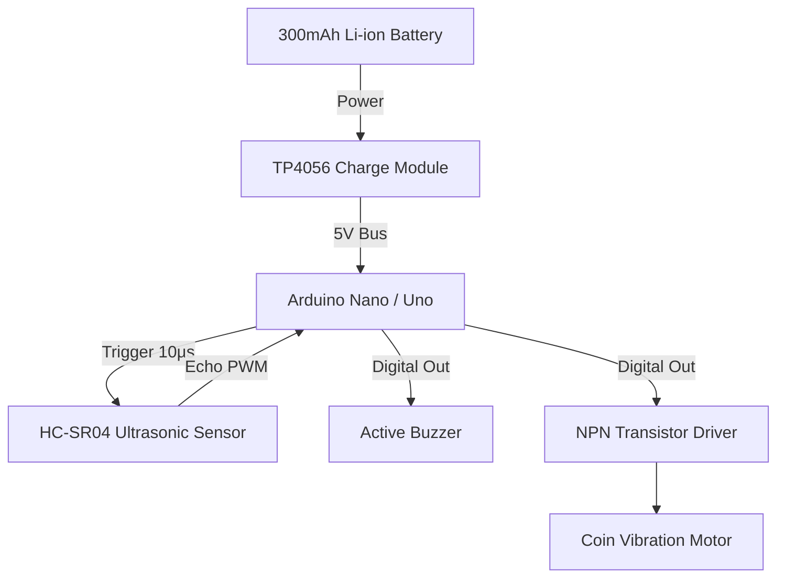

# Smart Blind Stick


## Executive Overview
Blindness and visual impairment significantly impact independent mobility and navigation. The traditional white cane, while foundational, is limited in its ability to detect obstacles beyond physical reach. This project outlines an assistive mechatronic device—a **Smart Blind Stick**—that augments the traditional cane with ultrasonic object detection, granting the user enhanced environmental awareness and early obstacle warning without requiring visual cues.

> [!IMPORTANT]
> **Medical Device Disclaimer**
> This device is a prototype assistive technology designed for academic demonstration. It should not be used as a sole replacement for certified mobility aids.

## Feature Highlights
- **Ultrasonic Range Finding**: Real-time object detection up to 1.5 meters using non-blocking timing logic.
- **Multimodal Feedback**: Tactile haptic feedback (vibration) and acoustic alerts (active buzzer).
- **Dynamic Alert Zones**: Distinct feedback pulsing frequencies for Safe, Warning (50-100cm), and Critical (<50cm) proximity thresholds.
- **Rechargeable Architecture**: TP4056 lithium-ion battery management for portable operation.

## System Architecture



## Theoretical & Mathematical Models

### Ultrasonic Distance Calculation
The HC-SR04 sensor operates on the principle of echolocation. The microcontroller sends a 10µs trigger pulse, causing the sensor to emit an 8-cycle sonic burst at 40kHz. The duration $t$ of the returning echo pulse is measured.
$$ d = \frac{v \times t}{2} $$
Where:
- $d$ = Distance to the object in cm.
- $v$= Speed of sound in air at 20°C ($\approx 343 \text{ m/s}$or$0.0343 \text{ cm/\mu s}$).
- $t$= Echo pulse duration in$\mu s$.

## Hardware Bill of Materials (BOM)
| Component | Specification | Quantity |
| :--- | :--- | :--- |
| Microcontroller | Arduino Nano / Uno | 1 |
| Distance Sensor | HC-SR04 Ultrasonic Sensor | 1 |
| Haptic Feedback | DC Vibration Motor (Coin type) | 1 |
| Acoustic Feedback | Active Buzzer | 1 |
| Battery | 300mAh 3.7V Lithium-ion | 1 |
| Power Management | TP4056 Type-C Module | 1 |
| Logic Driver | NPN Transistor (e.g., 2N2222) + Resistors | 1 |

## Complete Pinout / Wiring Matrix Table
| Component | Pin / Terminal | Arduino Pin | Notes |
| :--- | :--- | :--- | :--- |
| **HC-SR04** | VCC | 5V | Sensor Power |
| | GND | GND | Ground Reference |
| | TRIG | D9 | Output Trigger Pulse |
| | ECHO | D10 | Input Echo Measurement |
| **Vibration Motor** | Positive (+) | D5 | Switched via NPN transistor base |
| | Negative (-) | GND | System Ground |
| **Active Buzzer** | Positive (+) | D6 | Digital Output |
| | Negative (-) | GND | System Ground |
| **TP4056** | OUT+ / OUT- | Vin / GND | Main System Power Bus |

## Repository Layout Tree
```text
.
├── docs/                  # Original academic reports and historical assets
├── firmware/              # Reconstructed Arduino source code
├── hardware/              # Pinout and schematic matrices
└── _archive_unrelated/    # Extraneous files and unused resources
```

## Step-by-Step Firmware Setup & Prerequisites
1. Download and install the [Arduino IDE](https://www.arduino.cc/en/software).
2. Open the project firmware at `firmware/smart_blind_stick.ino`.
3. Connect the Arduino board to your computer via USB.
4. Select the appropriate target board (e.g., **Arduino Nano**) and COM port under `Tools`.
5. Compile and Upload the firmware.

## Authentic Documentation & Historical Asset Links
- **Project Report**: [`docs/A Smart Blind Stick using Arduino_حسن مقبل(1).pdf`](docs/)
- **Evidence Classification**: Due to missing original `.ino` files, the firmware logic is officially marked **[RECONSTRUCTED]** based strictly on the parameters documented in the verified PDF.

## Engineering Audit & Defensibility Limitations
- **Non-blocking Execution**: Standard delay functions stall microcontroller execution. This firmware was engineered using `millis()` tracking and a 30ms `pulseIn()` timeout to ensure the control loop remains highly responsive, even if ultrasonic waves scatter and fail to return.
- **Inductive Load Protection**: The DC vibration motor acts as an inductive load. Driving it directly from an Arduino GPIO pin risks catastrophic back-EMF voltage spikes. A proper NPN transistor driver circuit with a flyback diode is essential to isolate the microcontroller.

---

**Hassan Moqbel Morshed Ghaleb**
Mechatronics Engineer | Mechanical Design & CAD (SolidWorks & AutoCAD) | Preventive Maintenance & Electromechanical Systems | Industrial Automation, Control Systems, Robotics & Intelligent Machines | CAD/FEA, Embedded Systems, Python & C++
[GitHub](https://github.com/Hassan-Moqbel) · [Facebook](https://www.facebook.com/share/1BqxAgVjHi/) · [LinkedIn](https://www.linkedin.com/in/hassan-moqbel)

## License
This project is licensed under the GPL-2.0 License.
